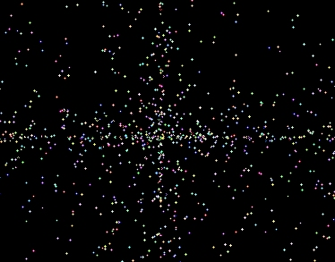

<div align="center">

## pulsar screen saver


</div>

### Description

Pretty little screensaver. Idea was to create a pulsar like effect with multi-colored pointed stars. I have way too much time on my hands. Don't bother voting unless you feel absolutely compelled to.
 
### More Info
 


<span>             |<span>
---                |---
**Submitted On**   |2002-11-01 14:51:58
**By**             |[Stan Amditis](https://github.com/Planet-Source-Code/PSCIndex/blob/master/ByAuthor/stan-amditis.md)
**Level**          |Intermediate
**User Rating**    |5.0 (15 globes from 3 users)
**Compatibility**  |VB 6\.0
**Category**       |[Complete Applications](https://github.com/Planet-Source-Code/PSCIndex/blob/master/ByCategory/complete-applications__1-27.md)
**World**          |[Visual Basic](https://github.com/Planet-Source-Code/PSCIndex/blob/master/ByWorld/visual-basic.md)
**Archive File**   |[pulsar\_scr1490391112002\.zip](https://github.com/Planet-Source-Code/stan-amditis-pulsar-screen-saver__1-40326/archive/master.zip)

### API Declarations

```
Declare Function GetWindowLong Lib "user32" Alias "GetWindowLongA" (ByVal hwnd As Long, ByVal nIndex As Long) As Long
Declare Function GetClientRect Lib "user32" (ByVal hwnd As Long, lpRect As RECT) As Long
Declare Function SetWindowLong Lib "user32" Alias "SetWindowLongA" (ByVal hwnd As Long, ByVal nIndex As Long, ByVal dwNewLong As Long) As Long
Declare Function SetParent Lib "user32" (ByVal hWndChild As Long, ByVal hWndNewParent As Long) As Long
Declare Function SetWindowPos Lib "user32" (ByVal hwnd As Long, ByVal hWndInsertAfter As Long, ByVal X As Long, ByVal Y As Long, ByVal cx As Long, ByVal cy As Long, ByVal wFlags As Long) As Long
Declare Function ShowCursor Lib "user32" (ByVal bShow As Long) As Long
Declare Function FindWindow Lib "user32" Alias "FindWindowA" (ByVal lpClassName As String, ByVal lpWindowName As String) As Long
```


